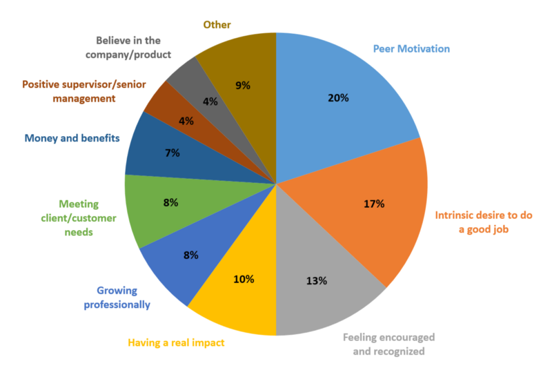

Your organization's profitability is largely dependent on employee enthusiasm, productivity, and loyalty. Therefore, you need to spend at least as much time creating an engaging ecosystem as you do while hiring new talent.

When was the last time you felt motivated in life, lest at your workplace? If you find scratching your brains at the onset of this question, fathom the emotions running among your employees.

Motivation is a tricky word. It can make or break you. It becomes even trickier when it comes to keeping others motivated, especially when they are your employees. Legend has it that organizations which have failed to keep their employees in high spirits have seen the doomsday.

So what is that one monkey trick that can bail you out from a situation like this? Trust us, no one bill fits all. The trick is to know the individuals of your team well and consciously customize your communication and gestures. Not to forget that they have to blend well with your organization's vision and environment since you don't have to sound like an employee-pleaser, or do you?

Some of the recent studies have proved that employees have moved beyond money as a motivation factor. While of course, money is important, it does not top the list for the new age workforce. Employees are increasingly seeking an engaging ecosystem with 20% of the respondents finding peer motivation as a performance booster while 13% feel being encouraged and recognized as highly motivating.

[Source](https://www.psychologytoday.com/us/blog/mind-tahe-manager/201412/what-motivates-employees-go-the-extra-mile)

Wait no more as we bring to you nine tips on how to keep the adrenaline rushing high among the employees of your organization. Read on.

### 1. Roll out the red carpet

No, you don't have to treat your employees like film stars but making them feel good should definitely be on your checklist. Your employees are spending a great deal of their time at the workplace, therefore, making it a conducive, engaging, productive and fun environment should be your prerogative.

Design spaces that reflect your organization's culture and values. Provide a balance between hard work and recreation. Give them a sense of belonging because as the wise men say, take care of your employees and they will take care of your business.

You can simply start by identifying a nook at the workplace for recreational activities or putting up the core values of your organization on the walls.

### 2. Be the most enthusiastic kid on the block

Did you know that enthusiasm is contagious? We tell you it is lethal. Try it out and you would know.

Lead the team with passion and enthusiasm. Show them the vigor in you to arouse the yearning of success in them. Communicate with them frequently, preferably face-to-face. Show them what hard work tastes like. Be their leader, their role model. You know it or not, your employees are definitely looking up to you.

### 3. Pat, pat and more pat

You could swap it with a high-five, a clap, a standing ovation or a loud announcement. The idea is to celebrate success. Pat your employees' backs for achievements even if they are personal. Empower them with appreciations, through words or gestures. Understand, they need to feel valued. They wish to feel on the top of the world, at times. And trust us, there is no harm in doing so. This will not only keep the employee in point motivated but will also help others keep up with their spirits to do more.

### 4. Empathy vs sympathy

Most of us do not understand the difference between the two. Though it is imperative to be sympathetic to your employees post a misfortune, do not forget to empathize with them on the slight sign of a discomfort or a breakdown. Try to read into their minds and strike conversations if need be.

Provide them with counseling services or organize sessions that would help them overcome their sorrows or issues that they might be facing at the workplace or back home. Remember, a happy employee is your best employee.

### 5. Redefine flexibility

So most of your employees are just a call away when it comes to work. They are stretching themselves to meet that ever-so-important deadline. So when it comes to you, are you going that extra mile to accommodate their feelings and demands?

For the hardworking lot, it's reasonable to expect flexibility from their employers from time to time. Being flexible is one way of showing your appreciation towards their work and thus sending out a message that you value them. Allow them to work-from-home, provide flexible timings. Grant them leaves at short notices if need be. Because as per a Forbes study, 46% of people look for flexibility at a workplace while searching for a job. You definitely don't want to miss out on the best of the talent.

### 6. Let them feel like a boss

This one advice works like a magic wand, trust us. There is nothing more empowering than the power of control, of authority. Don't be a micro-manager. Let your employees have a say in the way they work. Let them prioritize their day. To your surprise, most of them would come up with suggestions on how they can be more productive. Take their advice and implement it.

### 7. Your lips shouldn't lie

Respect can only be earned. And you can do it by being honest, transparent, non-judgmental and non-biased. There will be times when you wouldn't be able to stick to one of these virtues. Don't! Just keep your emotions under wraps.

Legends have it that bad management is one of the top reasons employees run for the hills. And there's a lot more you can do to be a great leader and mentor. You can start by making a point to share growth and business data with your employees on a regular basis. Send out daily, weekly, or monthly reports. Having access to all this data not only makes your employees feel like they're an important part of the business but will also help in building trust.

### 8. Be their growth hormone

Would you like to tread on a dark, unknown path? Neither would your employees. The key is to keep them informed. Your employees will be more motivated when they know they're working towards something, a definite goal. If at any point in time they think there's no opportunity for growth and learning, they might take a step back.

Your employees don't want to work a dead-end job. So what do you do? The answer is simple: empower them with skills through training to keep them motivated. Show them that you are as concerned about their career growth as they are. By doing this you are not only keeping them going but are also building a reputation for your organization.

### 9. Ask them what they want

Don't bother yourself with the guesswork. Don't wait for your employees to approach you. Take that step ahead and sit down and talk. Figure out their expectations and the experience thus far. Take feedback and fix in the gaps. It might not be physically possible for you take personal feedback from each one of them, there's a simple thing that you can do: circulate a feedback or grievances form and promise to keep the responses confidential. Remember, you need to build in that trust.

Your organization's profitability is largely dependent on employee enthusiasm, productivity, and loyalty. Therefore, you need to spend at least as much time creating an engaging ecosystem as you do while hiring new talent. So, figure out the motivational methods that work best for your workforce and work towards it.

Originally published at [Medium](https://medium.com/unrove/9-ways-to-keep-employees-motivated-besides-money-7a8c80f92cc8) on April 3, 2018.
