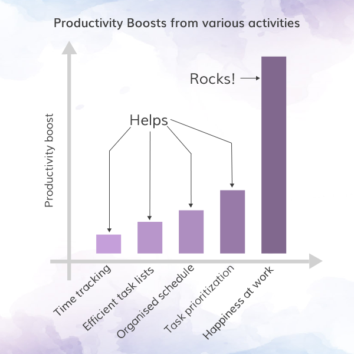
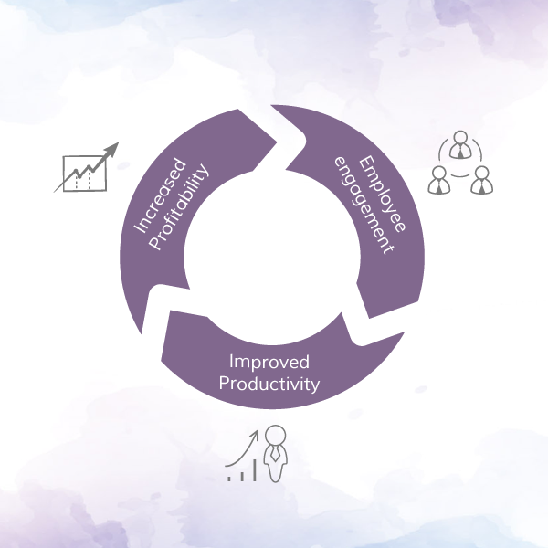
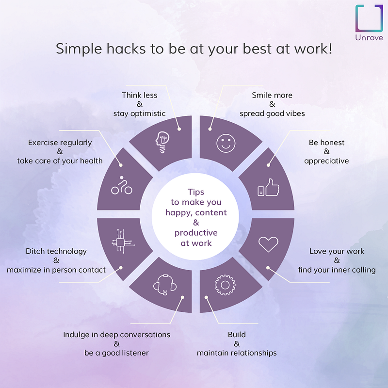

_This is a continuation of part 1:_ [Happy employees work better: what it means for organizational productivity](/blog/happy-employees-work-better-part-1-what-it-means-for-organizational-productivity/)

When was the last time you truly enjoyed working on a project at work?

How were you feeling during that time?

Did you realize that you were also feeling happy at that time?

If something bothers your happiness, then your passion at work plummets. Subconsciously this creates a sharp dip in your efficiency. No matter how hard you try, if you are not happy with what you are doing, you might be failing at improving your productivity, performance, and passion.

Many theories and surveys have proved that personal happiness has a direct impact on your workplace productivity. Happy and satisfied employees are known to spike productivity by a significant amount. In fact, personal happiness is the most important factor to enhance your workplace productivity.

#### Happiness drives creativity and promotes success

A happy and satisfied person can only unleash his/her hidden potential. When a person is happy, (s)he is better inclined to focus on professional duties. When you are happy, your brain functions better, it unlocks a creative spree and helps you solve the complex problems. What's more, happiness is contagious. This means when you are happy, people around you are happy. You can make your peers and clients happier with fewer efforts.

#### Happiness and productivity go hand in hand

When you are happy with your purpose and work, you tend to be free from endeavors to prove your worth. Happiness ignites creativity and motivates you to work hard for achieving set objectives on hand. Unflinching focus without any form of stress results in dedicated efforts which improve the way you perform. When you work better, your company performs better.

#### Make an effort to stay happy

Your personal happiness is pertinent to professional growth. Personal happiness invokes positivity and makes you better equipped to handle difficult situations. While it can promise you phenomenal success in the workplace, your happiness can also help you stay inspired and become a guiding light for others.

#### How to stay happy

So, what should you do to stay happy? Follow these tips and you will be happier, content and more productive at your workplace:

> Think less and stay optimistic

> Smile more and spread good vibes

> Act with honesty

> Be appreciative

> Love your work and find inner calling

> Build and maintain meaningful relationships

> Indulge in deep conversations

> Listen to others mindfully

> Ditch technology and maximize in-person contact

> Exercise regularly and take care of your health

If you are an organization, foster an environment and culture that catalyzes all of the above-mentioned behavior.

#### At the end

Happiness is a strong emotion. In fact, positivity and happiness collectively can perform more wonders than all complex management principles combined. When you are happy, you do not require extrinsic motivation to make yourself committed. So, it's better to invest in increasing your personal happiness if you want to be more valuable in your workplace and make a positive impact on organizational growth.

---

Originally published at [Medium](https://medium.com/unrove/happy-employees-work-better-part-2-what-it-means-for-your-growth-704227cd05c9) on May 9, 2018.
