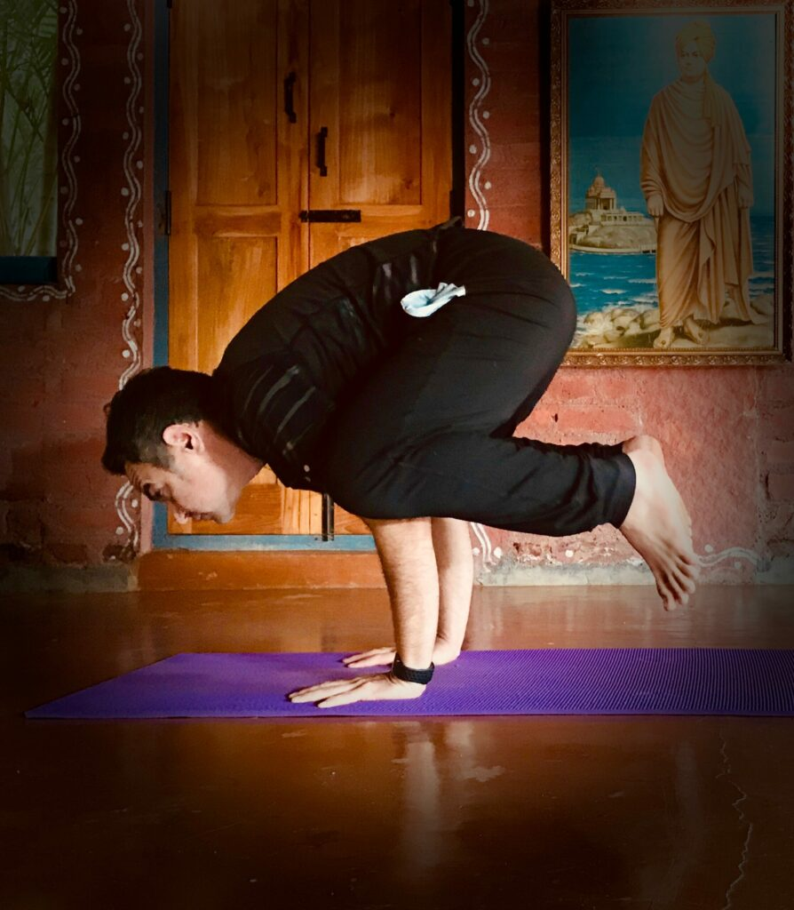
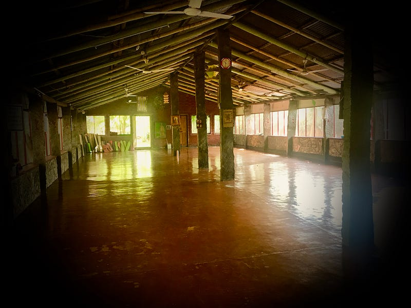

I completed Restorative Yoga Teacher Training 300 HRS in Mysore India. Before joining Swami Krishnananda Yoga Vidyapeeth last year, I did extensive research on "How to find an authentic yoga school in India?". In the past couple of months, people were asking a lot about how I found that school. It depends on your priorities, but I had the following top criteria:

#### Authentic

Must teach yoga in its purest form. For me, the purest form was to learn from Patanjali Yoga Sutra or Hatha Yoga Pradipika. I was coming across a lot of resort-like settings, fusion yoga, and yoga created by new-age yoga gurus. I did not want to start from there. I felt that I should start from the undiluted explanation and then grow the foundation. It was a good decision.

#### Teachers who live yogic life

Teachers should have experience, not only teaching but living yoga. It is important to gain knowledge from someone who has experienced it, not merely read about it.

#### Unpretentious setup

This means a lot. Yoga is all about self-exploration and journey within. In order to develop the relationship with self, you must not get distracted. These distractions include location, luxury, outside temptations, food, or comfort. It was difficult for me to stay away from work and family for 28 days. I wanted to get the most out of it. Learning was a higher priority than relaxation and unwinding.

Keeping these criteria, I started the search. I came across more than 20 good schools and all were difficult to pass. Eventually, I gained the clarity and it was a short but exciting journey.

**Here are some of my findings and tips:**

## Curriculum

Look at the curriculum — is it comfortable or a little challenging? Answers to find:

> Do they have a lot of breaks (too comfortable) or too many items which are unrealistic?

> Does it have a balance between Yoga, Pranayama and Lectures?

> Does the daily schedule align with basic human tendencies?

## Food and accommodation

Real yoga teaches simplicity. Food and accommodation must be simple. If you see a lot of pictures of delicious food and fancy accommodation, you should think twice. They might be trying to keep your attention away from other important aspects such as curriculum and the team. Adaptation and acceptance are also part of learning yoga.

*Sattvic Food*

## Diversity

Look at prior student pictures. Do you see diverse people or people from limited geography? Diversity makes an enormous difference. It broadens your perspective and makes learning a deeper experience. You will not only learn yoga but also learn how diverse people perceive yoga. It is very much valuable.

## Teachers

Scrutinize the teachers' profile, pictures, credentials, and reviews. If their own videos are available anywhere, look for them. Read and watch the testimonials. Look what others are saying about them. You must try to judge that in what situation others are saying as well. In many situations, they might be saying a lot of positives due to the high they get immediately after the completion of the course. Most video testimonials created by professionals might not tell the truth. Look for personal videos or blogs. There a user does not have any incentive or pressure to say good things about the school and the teachers. A good yoga teacher should know yoga (no pun intended), practice yoga, and must live yogic life. Well, it is not easy to judge from far, but you can try your best. You can have some intimations of their lifestyle. Look at the pictures or videos. Speak with them. Speak with past users. You can also try to figure out whether they were a yogi by choice or by an external force such as unemployment and business opportunity.

## Number of students

Batch size matters a lot. If a class is too large, you will be a part of an institute or a school that is like a university curriculum. If a class is too small then you might not get enough knowledge from the stories of diverse experiences. There are pros and cons to both. For me, the sweet spot was 15–25. That helps you balance between too broad and too narrow.

## External activities

Beware of highlighted external activities. Observe if they have put too much emphasis on the activities, especially in their curriculum. If so, the chances are high that they are attracting a special crowd — people who are looking for a relaxing experience rather than sincere learning. It depends on your priority, but if learning is your priority then don't get attracted.

## Schedule

It must be well-balanced, a little busy and according to yogic principles. First, the wake-up time. If the wake-up time is after 7:00 AM, you must rethink before choosing that school. In most cases, an authentic school day starts before 5:00 AM. Look at their breaks, food time and the placement of the content. For me, I wanted the school:

> That starts early in the morning

> Have longer yoga classes (2 and 3 hours)

> Must include karma-yoga

> Which has dinner time before sunset, and

> Which does not have a long afternoon break for self-study

Why? After comparing various school schedules, I felt that the above list aligns with my priorities. It really worked out well.

## Location

If the location is in nature, away from a city, that would be great. Again, you want to slash the distractions during your self-exploration journey. I also put a greater emphasis on having a class where there is good air circulation, such as in an open but shaded area. I felt that learning inside rooms for extended hours would not help me much. Again, this can be a personal choice.

*Yoga Shala*

## Meditation

If they have meditation in their curriculum, it was a red flag for me. I started my quest by looking for learning meditation. I realized that meditation is further away in the ladder when you are starting the journey. For the long run, you need to have the right foundation. You must start from yoga, then move into Pranayama and then Meditation. You cannot attain yogic meditation until you develop a healthy body and mind. Yoga is the first step towards it. Skipping the steps will not produce any result.

I hope this will help you find a good school that fits your personal needs. First exposure to yoga has a lasting effect and, in some cases, may not change for the rest of your life. Right research and the right school will pay off many times over. Reach out to me if you have any questions.

Originally published at [Medium](https://medium.com/@kkrupareliya/tips-to-find-authentic-yoga-teacher-training-school-in-india-768bdb9fbde) on May 29, 2020.
