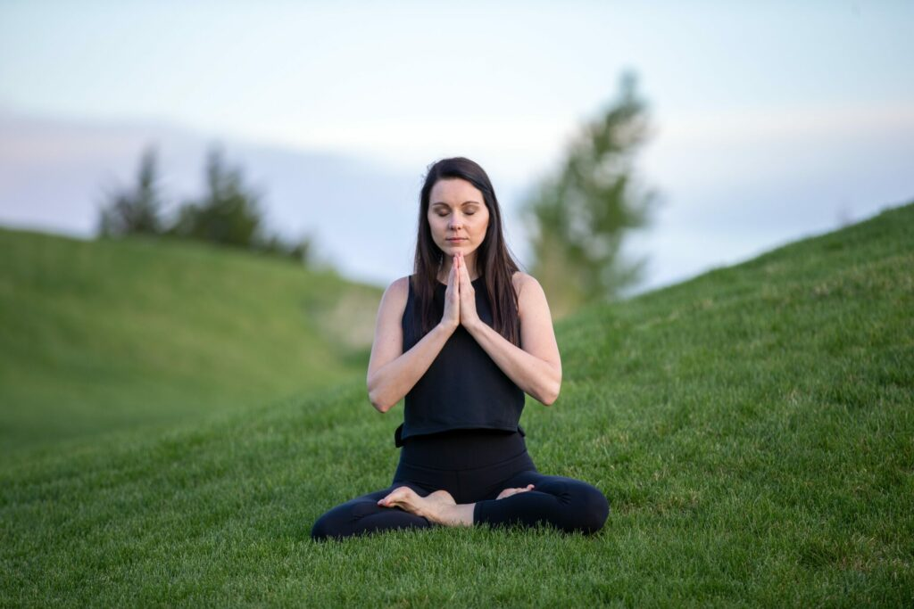

Yogic breathing has multiple definitions and interpretations. The scope of this article is to explain the breathing technique that should be used during Yogasana practice, while in pose or while inhaling and exhaling. It is also called segmental breathing. It can be done in segments or, in better words, explained in segments. The purpose is to practice the complete breathing that involves all three segments.

Yogic breathing has three components:

1. Abdominal breathing
2. Thoracic breathing
3. Clavicle breathing

Let's understand them one by one.

## Abdominal breathing

It is also called deep breathing, diaphragmatic breathing, abdominal breathing, or belly breathing. This is primarily done by contracting the diaphragm. The [diaphragm](https://en.wikipedia.org/wiki/Thoracic_diaphragm) is the muscle horizontally located between the chest and stomach cavity. Air enters the lung and your stomach, below the rib cage, expands during this breathing. That is why it is called belly breathing or abdominal breathing as well. This breathing takes the longest time and potentially allows you to retain the most amount of air.

[Watch: Abdominal breathing](https://youtu.be/WeoQLkQxxJI)

### How to practice abdominal breathing

- Imagine a balloon in your middle or belly
- The balloon expands with inhale
- The balloon contracts with exhale
- Keep your right hand on the stomach to feel it and support the breathing, left hand in chin mudra
- Be comfortable and do not push too hard

## Thoracic breathing

It is also called shallow breathing, thoracic breathing or chest breathing. This is primarily done by inhaling minimal breath into the lungs. This breathing draws the air into the chest area using the [intercostal muscles](https://en.wikipedia.org/wiki/Intercostal_muscle). The lungs and diaphragm are not used to their full capacity. This is similar to rapid breathing. Most people keep breathing rapidly throughout the day as a result of emotional response to various conditions such as stress, anxiety, anger, or fear. In the past few years, there is proven research about the direct correlation of thoughts and the breathing pattern. Increased thoughts increase the breathing and decreased thoughts decrease the speed or prolong the breathing time. Numerous health benefits are associated when you increase the breathing time and keep the oxygen longer within your body. For the scope of this article, we have to understand, observe, and practice thoracic breathing in order to learn the complete yogic breathing.

[Watch: Thoracic breathing](https://youtu.be/73hu-fCSfdE)

### How to practice thoracic breathing

- While breathing, try breathing from chest, shallow breathing without activating the diaphragm
- While inhaling, visualize and observe the chest expanding right and left, not in front
- Exhale normally and quickly
- Keep your right hand on the chest to feel it and support the breathing, left hand in chin mudra
- Be comfortable and do not push too hard

## Clavicle breathing

It is also called clavicular, upper lobar breathing, or clavicle breathing. This is primarily done by raising the shoulders and the clavicles (collarbones) while inhaling air into the upper chest. The abdomen is contracted to allow maximum air to be drawn. This is difficult breathing to hold as it requires a lot of muscles to be activated. It is usually shorter than shallow breathing.

[Watch: Clavicle breathing](https://youtu.be/4hHFb1TwIXY)

### How to practice clavicle breathing

- While breathing, try breathing from the upper chest
- While inhaling, fill the air till the clavicle bones, no deep breathing
- Exhale will be spontaneous and quick, no forced exhalation
- Keep your right hand on clavicle bones to feel it and support the breathing, left hand in chin mudra
- Be comfortable and do not push too hard

## Yogic breathing = complete breathing = all three in one breath

[Watch: Complete yogic breathing](https://youtu.be/dUEpKeP3zBc)

According to authentic hatha yoga, asana should be performed with complete breathing, while in a pose or while inhaling and exhaling.

## Benefits of complete yogic breathing

- Increases O2 retention and CO2 exit
- Massages abdominal organs: liver, spleen, adrenal glands, kidneys, lower part of lungs, floor of heart
- Straightens the spine
- Each breath massages the [intervertebral disc](https://en.wikipedia.org/wiki/Intervertebral_disc)
- Increases movement of the diaphragm from 1–1.5 cm to 6–7 cm, raising air inhalation from around 200 ml to 1.5 liters

I usually try to utilize complete breathing while staying steady at a pose and count the number of yogic breathings to measure my progress. It requires some practice but just one yogic breath massages a lot of internal organs around the thoracic region. It also improves the blood flow around the heart and lungs. If you add yogic breathing to your yoga practice, it will amplify the benefits manyfold.
