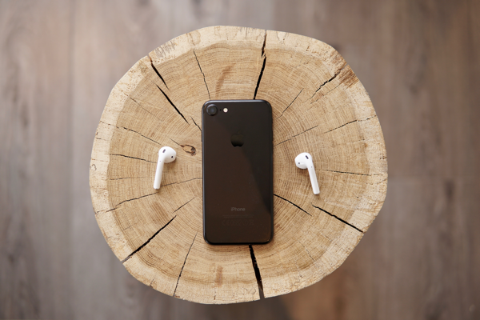

Apple is lacking significant innovation for the past few years. I feel innovation is stagnant and even declining at Apple.

Apple is lacking a solid innovation since past few years. As much as we like Apple products, we haven't seen any ground-breaking product. I feel innovation is stagnant or even declining at Apple. Here are a few viewpoints.

## iOS and Mac OS — just keeping up

Apple software is barely keeping up, including iOS and Mac OS. There hasn't been any excitement about new versions. They are circling around with the same scope, interface, and features. Instead of being a pioneer, I feel Apple is taking the inspiration from other systems and offering them with stunning marketing.

## Watch — neither a great fitness tracker nor smart enough

Apple Watch is not as useful as I hoped it would be. It is neither a good fitness tracker nor a great smartwatch. I felt interface and notifications were more of distractions and gimmick than usable. It is better than dozens of others out there but doesn't justify its origin.

## iPhone — better cameras with better battery life

The major lack of excitement is in the past few versions of iPhone. All of the processing power, look, better cameras, and better battery life have not been compelling enough after 10 years. Apple must make it more usable with associated smart hardware. Of course, it communicates with the majority of available IoT hardware, but by doing so it loses Apple's soul of simple, integrated experience. People will buy them until they realize that they have a better choice.

## Where does it lead?

Apple might have foreseen the declining future of iPhones or smartphones in general. After all, there are only certain things that can be done with smart hardware. To constantly grow the company at a similar pace, Apple must innovate other markets than just smartphones. I believe Apple will try to extract maximum money out of loyal customers in the next few years. They carry a fear of losing decorative earning charts. It will be a while for the users to realize the real value of the $1,000+ iPhone. Until then, let's help Apple boost the earnings because most of us don't have any better choice. The tendency of gaining more profit from similar products instead of forcing innovation has been proven to be a warning sign for the growth of any company.

With secrecy principles, we never know what's cooking inside Apple. It has been a few years since everyone is waiting for Apple to shake a new industry the way they did with personal computers, entertainment, and smartphones. It might just be the absence of Steve Jobs surfacing after all. Shaking of a new industry may happen or it will never happen. Currently, it seems like a very conventional tactic of boosting revenue to cover up the lack of innovation.

Photo credit: [Jaz King](https://unsplash.com/photos/4fegNAjoAl4).
